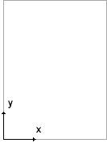
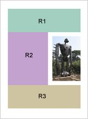

## Introduction to Acrostix

If you have programmed in PHP long enough, you'd know that there are functions for creating PDF files. In fact, there are two libraries available--PDFLib and ClibPDF. They both suffer the same problems though. First, there is no guarantee that either of the two is installed at a given hosting service. Second, they require you to generate an entire PDF document from scratch, a serious burden. Acrostix is an effort aimed at making dynamic PDF creation both easier and more accessible.

Acrostix is written in PHP, so you can deploy it on any server running PHP (4.2 and above). It can open an existing PDF file, onto which you can then place dynamic texts. There are functions for filling in PDF forms. You will also find that text formatting is easy in Acrostix, with its support for marked-up text.

Here's a quick demonstration of what Acrostix can do. Starting from a template PDF, the following code outputs a new document with a paragraph inserted:

```php
<?php

require("../acrostix/acrostix.php");

$text = file_get_contents("example1.txt");
$doc = ax_open_pdf_file("template1.pdf");
$style = ax_create_standard_styles("Times-Roman", 16);
$region = ax_create_rectangular_region(1, 1, 7.5, 8);
$lines = ax_lay_out_text($text, $region, $style, AX_FULL_JUSTIFY);
ax_add_page_elements($doc->pages[0], $lines);

header("Content-type: application/pdf");
ax_output_pdf_file($doc);

?>
```

First, we retrieve the sample text a file, which you can view it here. Then we open the template PDF. Next, we create a style array based on the built-in Times-Roman font with a call to `ax_create_standard_styles()`. Text styles are a somewhat big topic. I will discuss the mechanism for setting them in the future. For now, just note that we're using an associative array here, because the text is marked-up and each tag needs to have its own style.

We create a region with a call to `ax_create_rectangular_region()`, specifying where we want to place the paragraph. The parameters are `$left`, `$bottom`, `$right`, and `$top`, all measured in inches. Notice that PDF coordinates go from the bottom of the page up instead of the top-down system more commonly encountered in computer programming.

Finally, everything is passed to `ax_lay_out_text()`. The function returns a bunch of text objects, which we then add to the first page of the document. A call to `ax_output_pdf_file()` finishes the operation by sending the result to the browser.

## Filling out PDF forms

In this section you'll learn how to fill out a PDF form using Acrostix. The first thing you need, obviously, is a PDF form. You can create one using Adobe's own Acrobat Professional software, or a specialised package like Omniform or OneForm Designer. For demonstration purpose we'll just use a copy of the 1040EZ form.

Each field in a PDF form has a name. Unless you were the one who created the form, you wouldn't know what they are. Acrostix has a nifty function, `ax_reveal_form_fields()`, that put the names right on the document itself:

```php
<?php

require("../acrostix/acrostix.php");

$doc = ax_open_pdf_file("f1040ez.pdf");
if($doc) {
  ax_reveal_form_fields($doc);
  header("Content-type: application/pdf");
  ax_output_pdf_file($doc);
}

?>
```

Once you have the names then it's just a matter of calling the right functions. To fill out a text field, you'd call `ax_fill_text_field()`. The function takes five arguments: the document object, the name of the field, the text to put it, a style object, and a bitfield controlling the text alignment. To set a checkbox, call `ax_set_checkbox()`. To set a radio button, call `ax_set_radio_button()`.

The following snippet fills out a few of the fields in the 1040EZ:

```php
<?

require("../acrostix/acrostix.php");

$doc = ax_open_pdf_file("http://www.irs.gov/pub/irs-pdf/f1040ez.pdf");
if($doc) {
  $style = new AxTextStyle;
  $style->fontSize = 10;
  ax_fill_text_field($doc, 'f1-1', $_POST['f1-1'], $style);
  ax_fill_text_field($doc, 'f1-2', $_POST['f1-2'], $style);
  ax_fill_text_field($doc, 'f1-8', $_POST['f1-8'], $style, AX_RIGHT_JUSTIFY);
  ax_fill_text_field($doc, 'f1-9', $_POST['f1-9'], $style, AX_CENTER_JUSTIFY);
  ax_fill_text_field($doc, 'f1-10', $_POST['f1-10'], $style, AX_LEFT_JUSTIFY);
  ax_fill_text_field($doc, 'f1-3', $_POST['f1-3'], $style);
  ax_fill_text_field($doc, 'f1-4', $_POST['f1-4'], $style);
  ax_fill_text_field($doc, 'f1-11', $_POST['f1-11'], $style, AX_RIGHT_JUSTIFY);
  ax_fill_text_field($doc, 'f1-12', $_POST['f1-12'], $style, AX_CENTER_JUSTIFY);
  ax_fill_text_field($doc, 'f1-13', $_POST['f1-13'], $style, AX_LEFT_JUSTIFY);
  ax_fill_text_field($doc, 'f1-5', $_POST['f1-5'], $style);
  ax_fill_text_field($doc, 'f1-6', $_POST['f1-6'], $style, AX_CENTER_JUSTIFY);
  ax_fill_text_field($doc, 'f1-7', $_POST['f1-7'], $style);
  ax_set_checkbox($doc, 'c1-1', $_POST['c1-1']);
  ax_set_checkbox($doc, 'c1-2', $_POST['c1-2']);
  ax_set_radio_button($doc, 'c1-5', $_POST['c1-5']);
  ax_remove_form($doc);

  header("Content-type: application/pdf");
  ax_output_pdf_file($doc);
}

?>
```

And you can see the web form that feeds it here. Just plain-old HTML. Nothing fancy.

One thing to note in the code is the `AxTextStyle` object created nearly the top. In the previous example we had use `ax_create_standard_styles()` to create a style array, because we were dealing with marked-up text. Here, we're using just one text style and have plain-text from the form. So we create a single style object. In the example only the font size is set. Acrostix will automatically default to Helvetica and the color black.

Another thing to note is the call to `ax_remove_form()`. It removes all form fields from a document object. This is done so that the Acrobat Reader wouldn't prompt the viewer about filling in the form.

Finally, if instead of showing the PDF document in the browser, you wish to send it to the user via e-mail, you can call `ax_generate_pdf_contents()` in place of `ax_output_pdf_file()` to obtain the PDF contents in a string.

## Basic Acrostix Operation - Step 1

The Acrostix library is developed around the idea that when a web application need to dynamically produce PDF files, only a small part of the document will be dynamic. Most of the time that dynamic part is going to be text. Hence the main objective is allowing developers to open existing PDF files and then overlay text onto them.

The basic steps in adding text to a PDF documents are:

* Open the PDF document
* Define the area where the new text will go
* Define the appearance of the text
* Create text objects containing the new text
* Add the text objects to the correct page in the document
* Save the PDF file or sent it to the web browser

In this section I will discuss the first step in some details.

First, opening a PDF document. To open a PDF file, simply call `ax_open_pdf_file()` with the path to the file as the only parameter. If the PDF document is stored, for example, in a database, pass the contents to `ax_parse_pdf_contents()` instead. This is the function called by `ax_open_pdf_file()` internally, after loading the file through `file_get_contents()`.

It should be noted that Acrostix does load the entire file into memory. As the document is parsed, its contents are replicated once more. If the document is large, the script could consume quite a bit of memory.

You can also create a PDF document from scratch, using `ax_create_document()`. Initially the returned document is without any pages. To add a page, create it by calling `ax_create_page()`, passing the width and height (in inches) as parameters, then attach it to the document object by appending to its pages property:

```php
$doc = ax_create_document();
$page = ax_create_page(8, 11.5);
$doc->pages[] = $page;
```

Notice how in the example, you need to manipulate an object property directly. Acrostix doesn't have a blackbox design. Not every implementation detail is encapsulated. A programmer using the library is expected to work directly with the data structures sometimes.

## Basic Acrostix Operation - Step 2

The second step in adding text to a PDF document is defining where the text will go. Acrostix provides two functions for this purpose `ax_create_rectangular_region()` and `ax_create_multicolumn_region()`. Both returns an object of the type `AxRegion`, which you would then pass as the second parameter to `ax_lay_out_text()`.

`ax_create_rectangular_region()` creates a simple rectangle. The parameters to the function are: `$left`, `$bottom`, `$right`, `$top`. All four are expressed in inches. An important thing to notice here is the order of the parameters. They are not arranged as coordinates of the upper-left-hand corner followed followed by those of the lower-right-hand corner as typically done in programming. Remembering this will save you a lot of frustration. PDF documents use the true Cartesian coordinate system. The origin is at the lower-left-hand corner. A larger y-coordinate means higher up. Hence `$top` should always be larger than `$bottom`.

`ax_create_multicolumn_region()` creates a region consisting of multiple columns. The function accepts six parameters: `$left`, `$bottom`, `$right`, `$top`, `$columns`, `$gutter`. The first four defines the bounding rectangle; `$columns` is the number of columns; and `$gutter` is the spacing between the columns, expressed in inches. The width of the individual columns is given by:

```
(($right - $left) - ($gutter * ($columns - 1))) / $columns;
```

In addition to the using two pre-defined functions, you can also create more complicated text lay-out by manipulating an `AxRegion` object directly. A region is just an array of rectangles. A rectangle is represented in `Acrostix` internally as an array with four elements, each a coordinate expressed in points (1/72 of an inch).

Suppose we want to have our text wrapped around an picture. We would want to create a region with three rectangles, as shown on the right. The following example accomplishes this:

```php
<?php

require("../acrostix/acrostix.php");

$text = file_get_contents("example3.txt");
$doc = ax_open_pdf_file("template3.pdf");
$style = ax_create_standard_styles("Times-Roman", 16);

$region = new AxRegion();
$R1 = array(0.5 * 72, 8.0 * 72, 8.0 * 72, 10.5 * 72);
$R2 = array(0.5 * 72, 3.0 * 72, 4.0 * 72, 8.0 * 72);
$R3 = array(0.5 * 72, 0.5 * 72, 8.0 * 72, 3.0 * 72);
$region->rectangles = array($R1, $R2, $R3);

$lines = ax_lay_out_text($text, $region, $style, AX_FULL_JUSTIFY);
ax_add_page_elements($doc->pages[0], $lines);

header("Content-type: application/pdf");
ax_output_pdf_file($doc);

?>
```

Again, notice how the 4th element of each array (top) is bigger than the 2nd (bottom) and that the y-coordinates of R1 are larger than those of R2 and R3.

> A larger y value means higher up.

That is something worth remembering while working with Acrostix.
